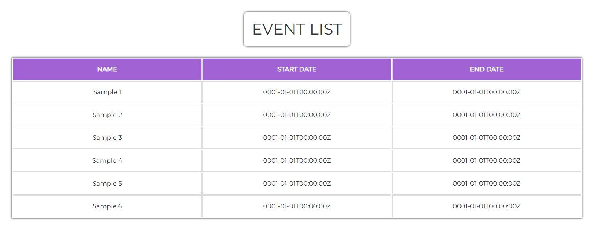

# EventsHandler

A intro to a fullstack application before I start a major project

## The Idea

The idea was to build an events application that uses GET, POST and PATCH requests to gain an understanding of the how the `client` interacts with the `backend server`, and how the `backend server` interacts with a database.

Seek the amazingly illustrated idea below 


## The Workings

### Client

Client is using `React`, `Typescript`, `vite` and `bootstrap`. This generates a table and calls the events API on `localhost:3000/events` to grab the events from the backend database. 



You can see the request being made here which is being logged in the `backend`


It also allows you to click on the name field in the table and change the name of the event which sends a request to `localhost:3000/events/<eventid>`.


### Backend

The backend is written in `Go`, using `Fibre`, `Viper` and `Mongo Driver` to control the routing and data.

First it uses the `config/config.go` file to load your env variables into the application which is currently the `port` of the server and the `Mongo DB address` (app.env.example)

As part of loading the app, it also connets to the Mongo DB and will crash if no connection can be made


We have a router.go file to manage routes and a events.go file to manage all the event requests and error on any unsupported methods. There is a POST request built for this but not used with the client

There's also functions built for handling GET (with or without an ID), POST and PATCH events to build out further functionality

As part of shutting down, when the application is killed, it safely disconnects from the database and safely signals to the OS.

### Database

The database is pretty simple, it's just a docker container running Mongodb using the below

```docker run -d -p 27017:27017 -h localhost --name mongodb mongo:7.0.0```

## The Outcome

As much as I didn't get the add button added in, I gained the experience I wanted to before trying something a little more extreme. Also found I dislike working with frontend tools...